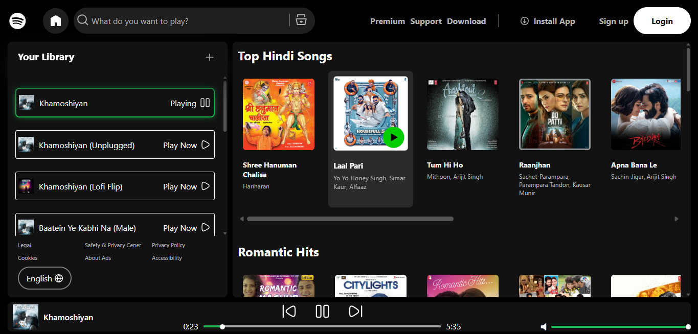

# 🎧 Clonify – A Spotify-Inspired Music Player

Clonify is a sleek, responsive, and fully custom-built web music player made using **HTML**, **CSS**, and **JavaScript**. It mimics the look and feel of Spotify while offering real-time playback functionality.

## ✨ Features

- 🔍 Song search functionality
- ▶️ Custom play/pause, next/previous controls
- 📀 Draggable seek bar with live time display
- 🔊 Volume control with mute/unmute toggle
- 💿 Dynamic library section
- 📱 Fully responsive (mobile & desktop)
- 📸 Song thumbnails and track info

## 🖼️ Screenshot

## 🚀 Live Demo

[🔗 Visit Site](https://raunak-1703.github.io/clonify/)

---

## 📁 Folder Structure

